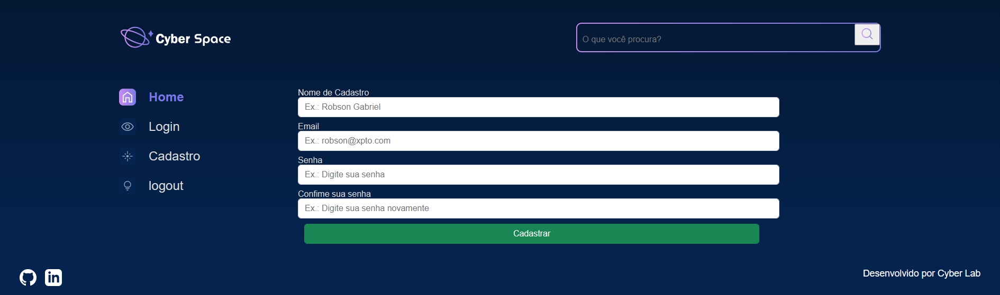
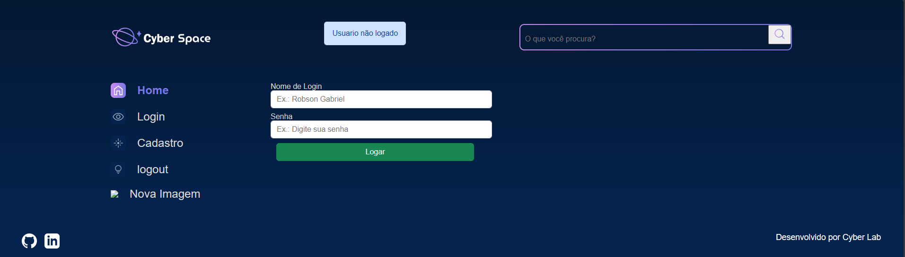
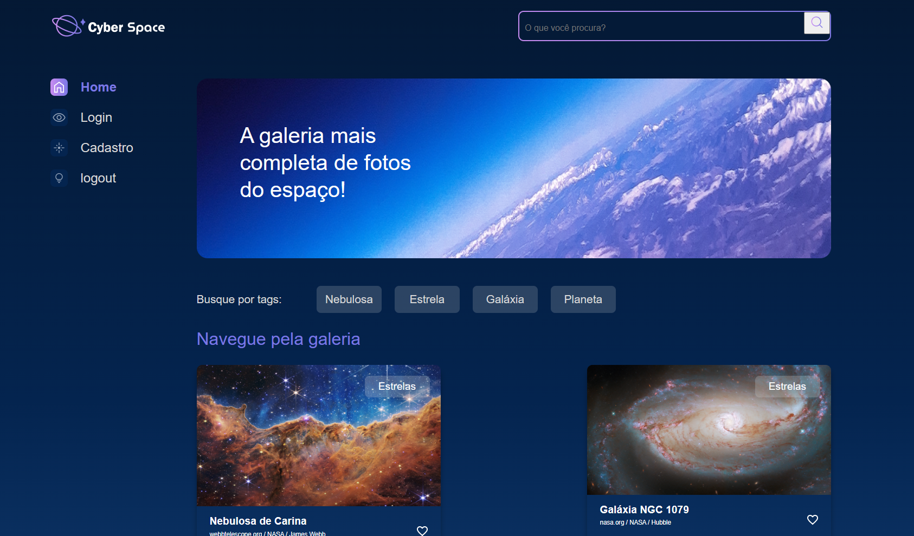

# 🚀 Cyber Space

Projeto desenvolvido em **Python com Django** que simula uma plataforma de galeria de imagens do espaço. Usuários podem se cadastrar, fazer login, navegar pelas imagens categorizadas por tags e realizar o upload de novas imagens.

---

## 🔍 Funcionalidades

- ✅ Cadastro e login de usuários
- ✅ Upload de novas imagens com metadados
- ✅ Sistema de tags (Ex: Galáxia, Estrela, Planeta, Nebulosa)
- ✅ Filtro de imagens por categoria
- ✅ Sistema de autenticação com sessão
- ✅ Layout responsivo com navegação lateral
- ✅ Busca de imagens por nome ou categoria
- ✅ Design moderno com foco em usabilidade

---

## 🛠️ Tecnologias Utilizadas

- **Linguagem:** Python
- **Framework Web:** Django
- **Template Engine:** Django Templates
- **Estilização:** HTML5, CSS3 (custom), ícones do Font Awesome
- **Banco de Dados:** SQLite (padrão Django)
- **Versionamento:** Git e GitHub

---

## 📸 Imagens do Projeto

### 🔐 Página de Cadastro


### 🔐 Página de Login


### 🌌 Galeria Principal


---

## ⚙️ Como Executar Localmente

1. Clone o repositório:
   ```bash
   git clone https://github.com/seu-usuario/cyber-space.git
   cd cyber-space
